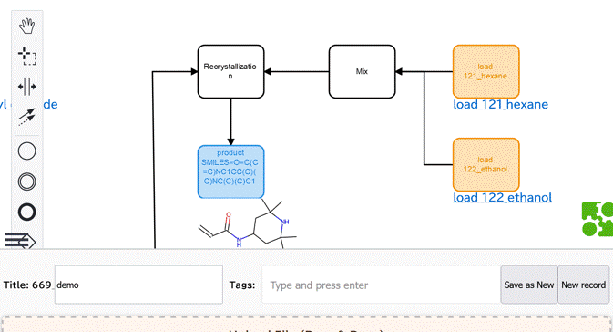

# FlowMater 3.1
- Flowchart of Materials
- Create and analyze flowcharts related to material projects


# What can be done?
- Create and edit flowcharts as graph data ([bpmn-js frontend](https://bpmn.io/toolkit/bpmn-js/))
  - Flowchart generation
  - Editing labels (with word suggestion)
- Manage data ([django backend](https://docs.djangoproject.com))
- Machine learning
  - For instance, it can visualize [graphs](ml/examples/data/show2.html) with important nodes

# Related paper
- Manuscript in preparation
- [ChemRXiv 2022](https://doi.org/10.26434/chemrxiv-2022-w1c6h)
- ...

# Requirement 
- Python or docker environment
  
# How to use?
- [Manual is here](manual/README.md)
- Summary
  - 1. Clone this repo.
      - ```gh repo clone KanHatakeyama/flowmater3.1```
  - 2. Build image
      - ```docker build -t fm3 .```
  - 3. Run docker
      - ```docker run -p 8000:8000 -it fm3```
# Issues
- TODO
  - Searching graphs, etc.
- Security
  - Do not run the server in pulic. Some security issues
    - CSRF setting is off for file upload
    - Authentication system by JWT may not be great


# Author
- Kan Hatakeyama-Sato
- Waseda University
- https://kanhatakeyama.github.io/
- satokan@toki.waseda.(japan)