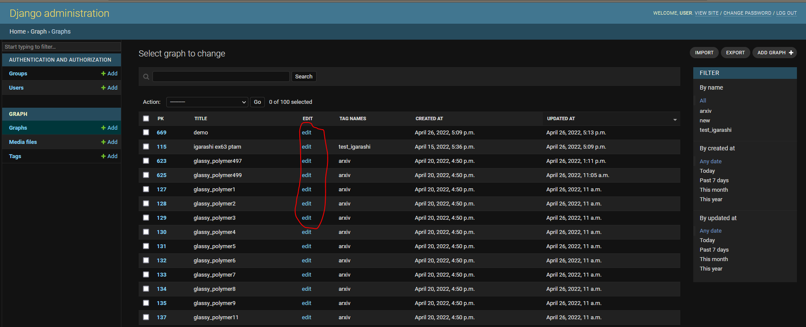
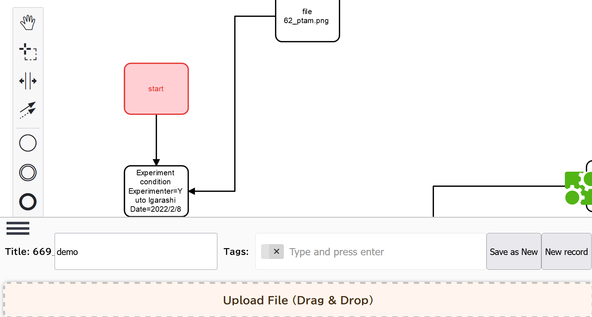

# TOC
- [TOC](#toc)
- [1. Install](#1-install)
- [2. Launch server](#2-launch-server)
- [3. Editing flowcharts](#3-editing-flowcharts)
- [4. Machine learning](#4-machine-learning)
- [About program](#about-program)
  - [How it works?](#how-it-works)

# 1. Install
- Here is a code for
  - machine ip: 192.168.11.7
  - port: 8000
 1. Clone this repo.
    - ```gh repo clone KanHatakeyama/flowmater3.1```
 1. [Change server ip](../back/README.md)
 1. Build image
    - ```docker build -t fm3 .```

# 2. Launch server
1. Run docker
    - ```docker run -it --name fm3 -v $(pwd):/code -p 8000:8000 fm3```
    - INFO: For the second and subsequent running of the container, enter the following command
    - ```docker start -ia fm3```

1. Run following commands to run server
    - ```conda activate chem```
    - ```cd back```
    - ``` python manage.py runserver 0.0.0.0:8000```
1. Access server by your browser
   - URL could be ...
   - http://192.168.11.7:8000/admin
1. Login page
    - Default user info
    - user
        - user
    - pass
        - 8Ob6k0kqGN75PD6gqd8W4Ec2I5JhjD

1. You can edit your flowcharts by clicking "edit" buttons
- Admin page

- Flowchart edit



# 3. Editing flowcharts
- There are some rules to describe machine-learnable flowcharts
- (under construction)

# 4. Machine learning
- (under construction)
- Overview
  1. Export flowchart data as JSON format via the admin page
  2. Parse JSON to [NetworkX object](https://networkx.org/)
  3. Machine learning

- Launching jupyter notebook
  1. Launch docker
  2. Run jupyter
    - Fow instance, ...
    - ```conda activate chem```
    - ```cd ml```
    - ```jupyter-notebook --port 8000 --allow-root --ip 0.0.0.0```
  3. There are some demo codes in the [example folder](../ml/examples/) 
    

# About program
## How it works?
- Frontend is made with [React](https://reactjs.org/) 
    - You don't need java development environment for use
        - It's already compiled
    - For development, node.js environment is needed
- Backend is made with [django](https://docs.djangoproject.com)

